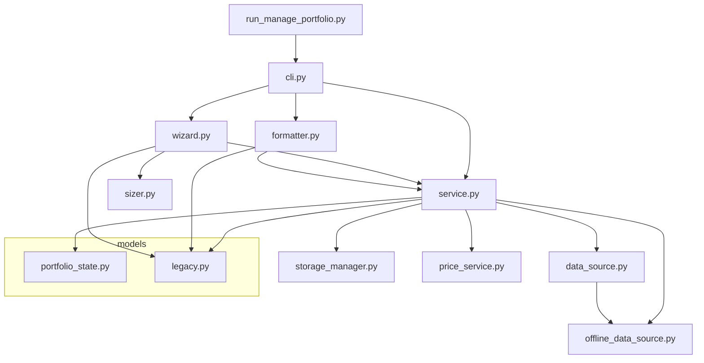

# IMP: Portfolio Manager Module Consolidation

> **Source:** `alm_portfolio-manager.csv`
> **Goal:** Extract the CLI menu from `manage_stoploss.py` into its own file and consolidate the module to reduce per-file complexity.

## Problem Analysis

### Current State (Before)

| File | Lines | Responsibility (Actual) |
|------|------:|------------------------|
| `manage_stoploss.py` | 720 | CLI Menus + Wizard Steps + Formatting + Broker Connect + Action Handlers |
| `service.py` | 335 | Portfolio Logic + Legacy Aliases + Journal Metrics |
| `offline_data_source.py` | 355 | XML Parsing + Risk JSON + Journal CSV |
| `sizer.py` | 131 | ✅ Clean (Minervini Funnel only) |
| `storage_manager.py` | 60 | ✅ Clean (JSON Load/Save only) |
| `data_source.py` | 82 | ✅ Clean (Abstract Interface) |
| `price_service.py` | 47 | ✅ Clean (Price Lookup) |
| `models/` | 163 | ✅ Clean (Data Classes) |

**Root Cause:** `manage_stoploss.py` violates SRP by combining 5 distinct concerns in one file.

### Target State (After)

| File | Max Lines | Responsibility (Single) |
|------|----------:|------------------------|
| `cli.py` | ~200 | **[NEW]** Menu rendering, input loops, main() |
| `wizard.py` | ~150 | **[NEW]** Wizard steps 1-4 + display logic |
| `formatter.py` | ~100 | **[NEW]** Dashboard table rendering (action_list) |
| `service.py` | ~250 | Portfolio logic (cleaned, no legacy aliases) |
| `offline_data_source.py` | 355 | Unchanged |
| `sizer.py` | 131 | Unchanged |
| `storage_manager.py` | 60 | Unchanged |
| `data_source.py` | 82 | Unchanged |
| `price_service.py` | 47 | Unchanged |
| `models/` | 163 | Unchanged |

**Net effect:** `manage_stoploss.py` (720 lines) → 3 files (~450 lines combined), `service.py` reduced by ~30 lines.

---

## PART 1: The System Skeleton (Shared Context)

The following types and interfaces are **read-only context** for all implementation tasks. They already exist and must NOT be modified.

### Data Classes (Existing — DO NOT MODIFY)

```python
# === models/portfolio_state.py ===
@dataclass
class Position:
    symbol: str
    quantity: float
    entry_price: float
    current_price: float = 0.0
    currency: str = "USD"

@dataclass
class PortfolioState:
    timestamp: str
    cash: float
    equity: float
    positions: Dict[str, Position] = field(default_factory=dict)

# === models/legacy.py ===
@dataclass
class PortfolioPosition:
    symbol: str; isin: str; quantity: float; raw_quantity: float
    direction: str; entry_price: float; currency: str
    # ... + market data, metrics, risk, status fields

@dataclass
class PortfolioSummary:
    total_invested: float; total_unrealized_pl: float; total_risk: float
    buying_power: float; equity: float
    position_count: int; count_ok: int; count_warning: int; count_danger: int

@dataclass
class SizingContext:
    equity: float; current_exposure: float
    target_exposure_pct: float; available_budget: float

@dataclass
class TradeParameters:
    symbol: str; entry_price: float; stop_loss: float
    risk_pct: float; max_position_pct: float; one_way_fee: float

@dataclass
class SizingResult:
    limit_risk_shares: int; limit_budget_shares: int; limit_size_shares: int
    suggested_shares: int; bottleneck: str
    invested_amount: float; invested_pct: float
    risk_amount: float; risk_equity_pct: float
    price_breakeven: float; price_2r: float; price_3r: float
    warnings: List[str] = field(default_factory=list)
```

### Service Interface (Existing Methods — Reference Only)

```python
class PortfolioService:
    # Core
    def load_portfolio_state(self) -> PortfolioState: ...
    def save_simulation_state(self): ...
    def get_portfolio_summary(self) -> PortfolioSummary: ...
    def get_positions(self) -> List[PortfolioPosition]: ...
    def get_open_positions(self, update_prices: bool = False) -> List[PortfolioPosition]: ...
    
    # Simulation
    def add_position_sim(self, symbol, quantity, price, date): ...
    def delete_position_sim(self, symbol): ...
    def update_paper_quantity(self, symbol, quantity): ...
    def init_from_live(self): ...
    def clear_paper_portfolio(self): ...
    
    # Metrics & Config
    def _get_journal_metrics(self) -> Tuple[float, float, float]: ...
    def update_paper_journal(self, equity, exposure): ...
    def update_stop_loss(self, symbol, stop_loss): ...
    
    # Aliases (Legacy)
    def get_summary(self) -> PortfolioSummary: ...     # alias for get_portfolio_summary
    def get_risk_settings(self) -> Dict[str, float]: ...
    def get_data_source(self): ...
    def set_data_source(self, data_source): ...
```

### Sizer Interface (Existing — Reference Only)

```python
class MinerviniSizer:
    def get_defaults(self) -> Dict: ...
    def calculate_wallet_context(self, equity, current_exposure, target_exposure_pct) -> SizingContext: ...
    def calculate_sizing(self, context: SizingContext, params: TradeParameters) -> SizingResult: ...
```

---

## PART 2: Implementation Work Orders

### Function Migration Map

This table shows where each function from `manage_stoploss.py` moves to:

| Function | Current Location | Target File | Reason |
|----------|-----------------|-------------|--------|
| `clear_terminal()` | manage_stoploss.py:25 | `cli.py` | UI utility |
| `parse_input_decimal()` | manage_stoploss.py:31 | `cli.py` | Input utility |
| `prompt_stop_loss()` | manage_stoploss.py:48 | `cli.py` | Input utility |
| `show_menu()` | manage_stoploss.py:77 | `cli.py` | Menu rendering |
| `show_live_menu()` | manage_stoploss.py:116 | `cli.py` | Menu rendering |
| `show_simulation_menu()` | manage_stoploss.py:151 | `cli.py` | Menu rendering |
| `action_manage_stops()` | manage_stoploss.py:171 | `cli.py` | Menu action |
| `action_init_paper()` | manage_stoploss.py:389 | `cli.py` | Menu action |
| `action_edit_paper_position()` | manage_stoploss.py:398 | `cli.py` | Menu action |
| `action_edit_paper_metrics()` | manage_stoploss.py:452 | `cli.py` | Menu action |
| `start_simulation_mode()` | manage_stoploss.py:473 | `cli.py` | Menu loop |
| `action_clear_paper()` | manage_stoploss.py:513 | `cli.py` | Menu action |
| `action_update_prices()` | manage_stoploss.py:586 | `cli.py` | Menu action |
| `action_switch_data_source()` | manage_stoploss.py:593 | `cli.py` | Menu action |
| `_connect_to_broker()` | manage_stoploss.py:620 | `cli.py` | Broker helper |
| `main()` | manage_stoploss.py:674 | `cli.py` | Entry point |
| `wizard_step_1_get_context()` | manage_stoploss.py:204 | `wizard.py` | Wizard Step 1 |
| `wizard_step_2_get_params()` | manage_stoploss.py:261 | `wizard.py` | Wizard Step 2 |
| `run_sizing_wizard()` | manage_stoploss.py:296 | `wizard.py` | Wizard Steps 3-4 |
| `action_list()` | manage_stoploss.py:522 | `formatter.py` | Dashboard table |

---

### T-001: Create `formatter.py` (Dashboard Renderer)

**Target File:** `py_manage_portfolio/formatter.py`
**Description:** Extract the `action_list()` function into a dedicated formatter module. This is the Minervini-style dashboard table.
**Context:** Uses `PortfolioPosition`, `PortfolioSummary` from models. Receives data from `PortfolioService`.

**Code Stub:**

```python
"""
Dashboard Formatter for CLI Portfolio Display.
Renders the Minervini-style position table with color coding.
"""
import os
from typing import Optional, List
from .service import PortfolioService
from .models import PortfolioPosition, PortfolioSummary

# ANSI Color Constants
C_RESET = "\033[0m"
C_BOLD  = "\033[1m"
C_RED   = "\033[91m"
C_GREEN = "\033[92m"
C_YELLOW = "\033[93m"

def render_dashboard(service: PortfolioService, max_equity_risk: float = 1.25):
    """
    Renders the Minervini Dashboard table to stdout.
    
    Args:
        service: The PortfolioService instance to read data from.
        max_equity_risk: Threshold for risk% coloring (from risk_settings).
    """
    # TODO: Implement — move body of action_list() here
    # 1. Call service.get_open_positions(update_prices=False)
    # 2. Call service.get_summary()
    # 3. Print header row (Sym, Days, Pos%, Price, Gain%, Stop, Dist%, Risk%, R, Status)
    # 4. For each position: format and color-code each column
    # 5. Print summary line (SUMMEN, CAPITAL, Position counts)
    pass
```

**Algo Steps:**
1. Copy entire body of `action_list()` (manage_stoploss.py lines 522-584) into `render_dashboard()`
2. Replace `service = PortfolioService(project_root=".")` fallback with raising an error (service is now always required)
3. Move `max_equity_risk` lookup into the function parameter (caller provides it from `service.get_risk_settings()`)
4. Extract ANSI constants to module-level

**Edge Cases:**
- Empty position list → print "Keine Positionen vorhanden."
- `None` values in `current_price`, `unrealized_pct`, `dist_pct` → display "---"

---

### T-002: Create `wizard.py` (Minervini Wizard Flow)

**Target File:** `py_manage_portfolio/wizard.py`
**Description:** Extract the 3 wizard functions into a dedicated wizard module.
**Context:** Uses `MinerviniSizer`, `SizingContext`, `TradeParameters`, `SizingResult`. Calls `PortfolioService` for metrics.

**Code Stub:**

```python
"""
Minervini Position Sizing Wizard.
Guided 4-step dialog for planning trades.
"""
from datetime import datetime
from typing import Optional
from .service import PortfolioService
from .sizer import MinerviniSizer
from .models import SizingContext, TradeParameters, SizingResult

def wizard_step_1_get_context(service: PortfolioService, sizer: MinerviniSizer, 
                                source: str = "live") -> SizingContext:
    """
    Step 1: Gathers portfolio status (Equity, Exposure) and calculates available budget.
    """
    # TODO: Implement — move body from manage_stoploss.py:204-259
    pass

def wizard_step_2_get_params(service: PortfolioService, 
                               sizer: MinerviniSizer) -> Optional[TradeParameters]:
    """
    Step 2: Collects trade parameters (Symbol, Entry, Stop, Risk%, MaxSize%, Fee).
    Returns None if user cancels.
    """
    # TODO: Implement — move body from manage_stoploss.py:261-294
    pass

def run_sizing_wizard(service: PortfolioService, source: str = "live"):
    """
    Orchestrates the full 4-step wizard flow:
    1. Get Context (Equity/Exposure)
    2. Get Trade Params (Symbol/Entry/Stop)
    3. Calculate & Display Sizing Analysis (The Funnel)
    4. Summary & Save to Simulation
    """
    # TODO: Implement — move body from manage_stoploss.py:296-387
    pass
```

**Algo Steps:**
1. Move `wizard_step_1_get_context`, `wizard_step_2_get_params`, `run_sizing_wizard` verbatim
2. Import `parse_input_decimal` from `cli.py` if needed (or inline simple float parsing)
3. The nested `fmt_limit()` helper stays inside `run_sizing_wizard` as a local function
4. Update `run_sizing_wizard` to import `render_dashboard` from `formatter.py` if it calls `action_list`

**Edge Cases:**
- User enters empty symbol in Step 2 → return `None`, wizard aborts gracefully
- `risk_per_share == 0` → handled by sizer (returns 0 shares + warning)

---

### T-003: Create `cli.py` (Menu Controller)

**Target File:** `py_manage_portfolio/cli.py`
**Description:** The main CLI controller. Contains all menu rendering, input loops, and action routing. This is the new entry point.
**Context:** Imports `PortfolioService`, `render_dashboard` from formatter, `run_sizing_wizard` from wizard.

**Code Stub:**

```python
"""
Portfolio Manager CLI — Main Menu Controller.
Entry point for the interactive command-line interface.
"""
import os
from datetime import datetime
from typing import Optional
from .service import PortfolioService
from .formatter import render_dashboard
from .wizard import run_sizing_wizard

# --- Utilities ---

def clear_terminal():
    """Clears the terminal screen."""
    os.system('cls' if os.name == 'nt' else 'clear')

def parse_input_decimal(val_str: str) -> float:
    """Robust parsing of user input for decimal numbers (handles ',' and '.')."""
    # TODO: Implement — copy from manage_stoploss.py:31-46
    pass

def prompt_stop_loss(symbol: str, direction: str, avg_entry: float, 
                     current_stop: float = None) -> Optional[float]:
    """Prompt for stop loss with validation."""
    # TODO: Implement — copy from manage_stoploss.py:48-75
    pass

# --- Menu Renderers ---

def show_menu(service: PortfolioService) -> str:
    """Display main menu v2.0 and return choice."""
    # TODO: Implement — copy from manage_stoploss.py:77-114
    pass

def show_live_menu(service: PortfolioService):
    """Sub-menu loop for Live Portfolio."""
    # TODO: Implement — copy from manage_stoploss.py:116-148
    # IMPORTANT: Replace action_list() calls with render_dashboard(service)
    pass

def show_simulation_menu(service: PortfolioService) -> str:
    """Display simulation sub-menu and return choice."""
    # TODO: Implement — copy from manage_stoploss.py:151-169
    pass

# --- Actions ---

def action_manage_stops(service: PortfolioService):
    """Interactive stop-loss editor."""
    # TODO: Implement — copy from manage_stoploss.py:171-201
    pass

def action_edit_paper_position(service: PortfolioService):
    """Sub-menu: Edit/Delete simulation positions."""
    # TODO: Implement — copy from manage_stoploss.py:398-450
    pass

def action_edit_paper_metrics(service: PortfolioService):
    """Manual editing of paper journal metrics."""
    # TODO: Implement — copy from manage_stoploss.py:452-471
    pass

def action_update_prices(service: PortfolioService):
    """Force update market prices."""
    # TODO: Implement — copy from manage_stoploss.py:586-591
    pass

# --- Broker Connection ---

def _connect_to_broker(service: PortfolioService):
    """Helper to connect to IBKR broker."""
    # TODO: Implement — copy from manage_stoploss.py:620-672
    pass

# --- Mode Loops ---

def start_simulation_mode():
    """Starts the simulation sub-menu loop."""
    # TODO: Implement — copy from manage_stoploss.py:473-511
    # IMPORTANT: Replace action_list() calls with render_dashboard(service)
    # IMPORTANT: Replace run_sizing_wizard calls with import from wizard.py
    pass

# --- Entry Point ---

def main():
    """Main CLI entry point."""
    # TODO: Implement — copy from manage_stoploss.py:674-716
    pass

if __name__ == "__main__":
    main()
```

**Algo Steps:**
1. Move ALL remaining functions from `manage_stoploss.py` into `cli.py`
2. Replace every `action_list(service)` call with `render_dashboard(service)` (from formatter)
3. Replace every `run_sizing_wizard(...)` call with import from `wizard.py`
4. Keep `parse_input_decimal` and `prompt_stop_loss` as local utilities in this file

**Edge Cases:**
- `main()` must handle `KeyboardInterrupt` gracefully (print farewell, exit)
- Broker connection failure in `_connect_to_broker` → catch `ConnectionError`, print message, do NOT crash

---

### T-004: Update Entry Point and Delete Old File

**Target File:** `run_manage_portfolio.py`
**Description:** Update the entry point to import from `cli.py` instead of `manage_stoploss.py`.

**Code Stub:**

```python
#!/usr/bin/env python3
"""
Wrapper script to run the Portfolio Manager CLI.
"""
import sys, os
sys.path.insert(0, os.path.dirname(os.path.abspath(__file__)))

from py_manage_portfolio.cli import main

if __name__ == "__main__":
    main()
```

**Algo Steps:**
1. Change import from `py_manage_portfolio.manage_stoploss` to `py_manage_portfolio.cli`
2. **Do NOT delete** `manage_stoploss.py` yet — keep it as backup until verification passes
3. After verification: delete `manage_stoploss.py` and remove any references

---

### T-005: Update `__init__.py`

**Target File:** `py_manage_portfolio/__init__.py`
**Description:** Update package init to reflect new module structure.

**Code Stub:**

```python
"""
py_manage_portfolio — Portfolio Management Module.

Components:
- cli.py:          CLI Menu Controller (Entry Point)
- wizard.py:       Minervini Position Sizing Wizard  
- formatter.py:    Dashboard Table Renderer
- service.py:      Business Logic (PortfolioService)
- sizer.py:        Minervini Sizing Calculator
- storage_manager: JSON Persistence
- data_source.py:  Abstract Data Source Interface
- offline_data_source.py: File-based Data Source
- price_service.py: Market Price Lookup
"""
```

---

### T-006: Clean Up `service.py` (Optional)

**Target File:** `py_manage_portfolio/service.py`
**Description:** Remove legacy alias methods and consolidate naming.

> [!WARNING]
> This task is OPTIONAL and should only be done AFTER T-001 through T-005 are verified working. The aliases exist for backward compatibility.

**Changes:**
1. Remove `get_summary()` → callers should use `get_portfolio_summary()` directly
2. Remove `get_risk_settings()` → move to `sizer.py` or a config module
3. Rename `clear_paper_portfolio()` → `reset_simulation()`
4. Rename `update_paper_quantity()` → `update_position_quantity()`
5. Rename `update_paper_journal()` → `update_simulation_metrics()`

---

## Verification Plan

### Automated
```bash
# 1. Syntax check (no import errors)
python -c "from py_manage_portfolio.cli import main; print('CLI OK')"
python -c "from py_manage_portfolio.wizard import run_sizing_wizard; print('Wizard OK')"
python -c "from py_manage_portfolio.formatter import render_dashboard; print('Formatter OK')"

# 2. Existing verification script
python verify_portfolio_service.py
```

### Manual
1. Run `python run_manage_portfolio.py` and navigate through all menus
2. Verify: Main Menu → [1] Live → [2] Wizard → Back → [2] Sim → [3] Wizard → Back → [q]
3. Verify: Dashboard table renders correctly in both Live and Sim contexts

---

## Dependency Graph (After Refactoring)



## Execution Order

| Order | Task | Depends On | Risk |
|:-----:|------|-----------|------|
| 1 | T-001: `formatter.py` | — | Low (pure move) |
| 2 | T-002: `wizard.py` | — | Low (pure move) |
| 3 | T-003: `cli.py` | T-001, T-002 | Medium (integration) |
| 4 | T-004: Update entry point | T-003 | Low |
| 5 | T-005: Update `__init__.py` | T-003 | Low |
| 6 | T-006: Clean `service.py` | T-001–T-005 verified | Optional |
